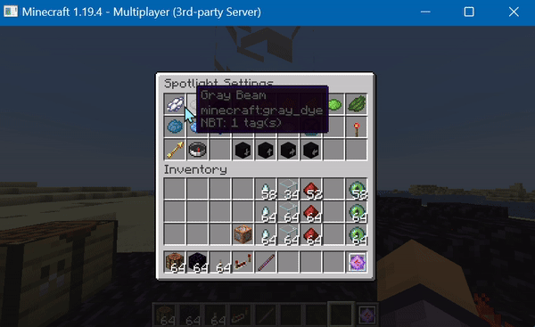
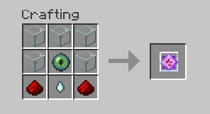

# CrystalSpotlights
A Minecraft Server Plugin that adds Spotlight Crystals to the game! Spotlight Crystals offer you the ability to customize their beams: You can change their color and angle, and even make them sweep back and forth! They are also redstone activated, so you can make extremely satisfying arrays of beam-sweeping crystals:

These are all the options in the settings menu!

This is how you craft a Spotlight Crystal:

Also, a command that is only available to operators is added: `/teststick <player>`
This command will give the player specified a "test stick", which can be used to get information from the crystal. It is intended for debugging purposes!

Currently, this plugin works for only minecraft version 1.19.4. Newer versions are in active development!

Please, If you find any glitches/bugs, open an issue! I will fix it!

This documentation is not complete!
